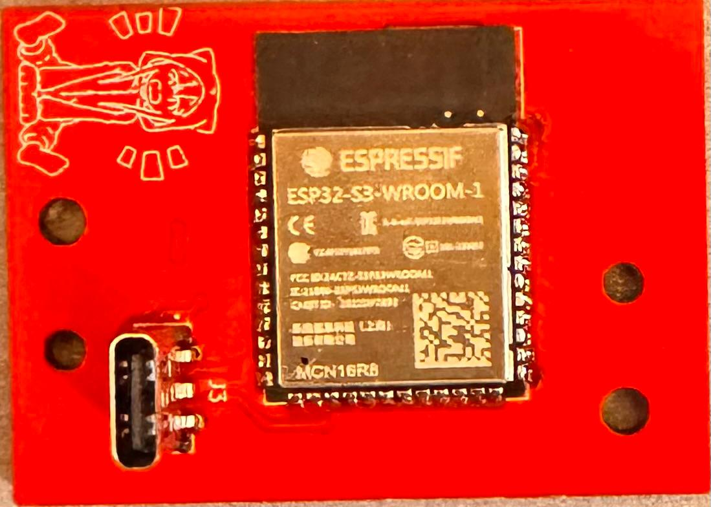
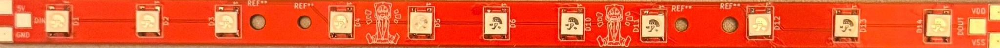
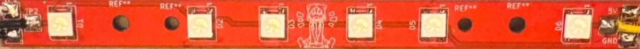
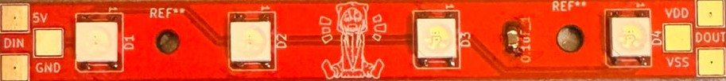
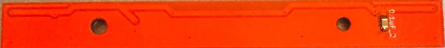

# Custom WLED Board (ESP32-S3)

A custom firmware build of [WLED](https://github.com/wled/WLED) v16.0.1, targeting a bare **ESP32-S3-WROOM-1-N16R8** module driving an addressable LED strip through a GPIO-switched MOSFET power stage. Developed as the firmware layer for a custom-designed LED controller board, the build is configured so that a freshly flashed unit ships with LEDs off and correct power-switch polarity by default, with no post-flash configuration required. PCB fabrication and assembly (motherboard and light stick designs) are documented separately via their own Gerber deliverables and are outside the scope of this repository.

---

## Table of Contents

- [Project Overview](#project-overview)
- [Hardware Gallery](#hardware-gallery)
- [Key Features](#key-features)
- [Hardware Specifications](#hardware-specifications)
- [Firmware Customizations](#firmware-customizations)
- [Repository Contents](#repository-contents)
- [Flashing a Pre-Built Release](#flashing-a-pre-built-release)
- [First Boot](#first-boot)
- [Building from Source](#building-from-source)
- [Author and License](#author-and-license)

---

## Project Overview

This repository is a `v16.0.1` fork of WLED with a minimal, targeted set of changes on top: a PlatformIO build environment for the ESP32-S3-WROOM-1-N16R8 module, and a one-line source patch that makes the "turn on at boot" behavior a compile-time default instead of a runtime setting a user has to configure. Everything else is unmodified upstream WLED, retained via full git history so the fork can track future upstream releases.

The goal is an appliance-grade default: a unit flashed straight from a release binary boots with its LED power stage off and correctly oriented for the board's MOSFET switching circuit, without requiring anyone to open the web UI and change settings first.

---

## Hardware Gallery

The physical production results of the custom-designed hardware, motherboard and light sticks:

### Motherboard
 

### Longest Light Stick
 

### Middle Light Stick
 

### Shortest Light Stick
 

---

## Key Features

- **Off-by-default boot state**, via a new `WLED_TURN_ON_AT_BOOT` compile-time flag patched into WLED's source (upstream hardcodes this to always-on).
- **Correct power-switch polarity out of the box**, matching the board's N-channel + P-channel MOSFET high-side switch topology.
- **Single merged flashable image**, combining bootloader, partition table, and application into one `.bin` written at offset `0x0` — no multi-offset flashing required.
- **16MB flash / 8MB octal PSRAM support**, targeting the ESP32-S3-WROOM-1-N16R8 module specifically.
- **Built on a stable upstream release** (`v16.0.1`), with the fork's full commit history preserved for future upstream syncs.

---

## Hardware Specifications

| Component | Specification |
|-----------|----------------|
| Microcontroller | `ESP32-S3-WROOM-1-N16R8` — 16 MB flash, 8 MB octal-SPI PSRAM |
| LED data pin | GPIO1 |
| LED count | 21 |
| Power switch pin | GPIO2, active-high, driving an N-channel + P-channel MOSFET high-side switch |
| Flash configuration | 16 MB, DIO mode, 40 MHz |

---

## Firmware Customizations

Two changes on top of a clean `v16.0.1` checkout, both committed in this repository's history:

**`platformio_override.ini`** (new file) defines the `esp32s3` build environment — pin assignments, LED count, relay/MOSFET pin and polarity, and release naming.

**`wled00/wled.h`** carries a one-line patch exposing `turnOnAtBoot` as a build flag, since upstream WLED hardcodes it:

```diff
// LED CONFIG
-WLED_GLOBAL bool turnOnAtBoot _INIT(true);                // turn on LEDs at power-up
+#ifndef WLED_TURN_ON_AT_BOOT
+  #define WLED_TURN_ON_AT_BOOT true
+#endif
+WLED_GLOBAL bool turnOnAtBoot _INIT(WLED_TURN_ON_AT_BOOT); // turn on LEDs at power-up
```

This build sets the flag to `false`, so the power stage never energizes without explicit user action.

---

## Repository Contents

```text
.
├── wled00/                 WLED firmware source (patched: wled.h)
├── boards/                 Board pin-mapping definitions
├── lib/                    Bundled third-party libraries
├── tools/                  Build tooling and custom partition tables
├── platformio.ini          Upstream WLED build environments
├── platformio_override.ini Custom esp32s3 build environment (this fork's config)
├── LICENSE                 Upstream MIT license
└── readme.md
```

The repository is otherwise a standard WLED checkout — see the [upstream project](https://github.com/wled/WLED) for full documentation on the underlying firmware.

---

## Flashing a Pre-Built Release

1. Download the latest merged `.bin` from the Motherboard_Files folder.
2. Install [esptool](https://github.com/espressif/esptool):
   ```bash
   python -m pip install esptool
   ```
3. Put the board into download mode if it doesn't reset into it automatically: hold **BOOT**, tap **RESET**, release **BOOT**.
4. Erase and flash (replace `COMx` with the board's serial port):
   ```bash
   python -m esptool --chip esp32s3 --port COMx erase_flash
   python -m esptool --chip esp32s3 --port COMx --baud 921600 write_flash 0x0 WLED_ESP32-S3_16MB_opi_MERGED.bin
   ```
   The image is a single merge of bootloader, partition table, and application, so it's written at offset `0x0` with no further offsets needed.

---

## First Boot

1. The board opens a WiFi access point named `WLED-AP`, password `wled1234`.
2. Connect to it and browse to `4.3.2.1` to enter your home WiFi credentials.
3. Once joined, reach the UI at `http://wled-XXXXXX.local` (`XXXXXX` is the last 6 hex digits of the board's MAC address — visible in the esptool output during flashing, or via your router's DHCP client list if `.local` doesn't resolve).
4. LEDs and the power switch stay off on every boot by default — no configuration required. Turn them on from the UI when ready.

---

## Building from Source

```bash
git clone <this-repo-url>
cd <this-repo>
python -m pip install platformio
python -m platformio run -e esp32s3
```

This produces `.pio/build/esp32s3/firmware.bin` (application only). To reproduce the merged, single-file release image:

```bash
python -m esptool --chip esp32s3 merge_bin \
  -o WLED_ESP32-S3_16MB_opi_MERGED.bin \
  --flash_mode dio --flash_freq 40m --flash_size 16MB \
  0x0     .pio/build/esp32s3/bootloader.bin \
  0x8000  .pio/build/esp32s3/partitions.bin \
  0x10000 .pio/build/esp32s3/firmware.bin
```

---

## Author and License

Developed by **Doruk Erel**.

Based on [WLED](https://github.com/wled/WLED). Released under the **MIT License**. See the `LICENSE` file for the full text.
